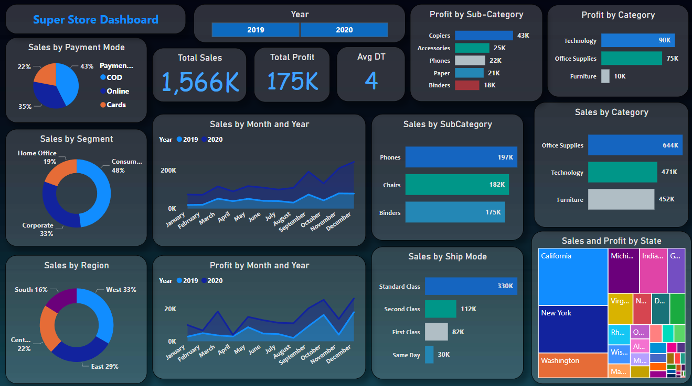
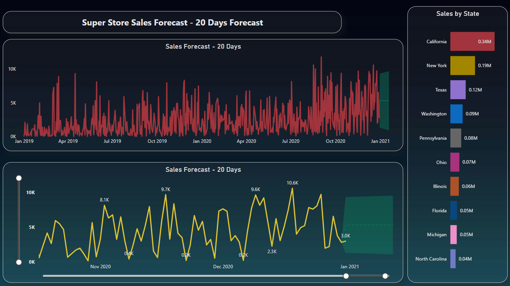

# super-store-sales-analysis
The SuperStore dataset comprises a comprehensive sales record from a superstore, containing 5600+ entries across 23 distinct fields. This project focuses on data cleaning, DAX calculations, dashboard creation, and a 20-day sales forecast to extract meaningful business insights and support data-driven decision-making.

#### Dataset Overview
The dataset includes the following columns:

- **Order Details**: `order_id`, `order_date`, `ship_date`
- **Customer Information**: `customer`
- **Product Details**: `product_name`
- **Segmentation**: `segment`, `category`, `subcategory`
- **Geographical Information**: `region`, `city`, `state`, `country`
- **Financial Metrics**:`profit`, `quantity`, `sales`, `profit_margin`

#### Data Visualization and Insights

1. **Total Sales & Profit Overview**:
   - Total Sales: 1,566K
   - Total Profit: 175K
   - Average Delivery Time (Avg DT): 4 Days
     
2. **Sales by Category**:
   - Office Supplies (644K) have the highest sales, followed by Technology (471K) and Furniture (452K).
     
3. **Profit by Category**:
   - Technology (90K) generates the highest profit, followed by Office Supplies (75K) and Furniture (10K).

4. **Sales by Subcategory**:
   - Phones (197K), Chairs (182K), and Binders (175K) are the top-selling subcategories.

5. **Profit by Subcategory**:
   - Copiers (43K), Accessories (25K), and Phones (22K) yield the highest profit.

6. **Sales by Payment Mode**:
   - Online payments account for 43%, followed by Cards (35%) and COD (22%).

7. **Sales by Region**:
   - West region (33%) has the highest sales, followed by East (29%), Central (22%), and South (16%).
     
8. **Sales and Profit by State**:
   - California, New York, and Washington are the top-performing states in sales and profit.

9. **Sales by Month and Year**:
   - Sales show an increasing trend over time, with peaks observed in certain months.
     
10. **Profit by Month and Year**:
   - Profit margins fluctuate across months but follow a similar pattern to sales trends.

11. **Sales by Ship Mode**:
   - Standard Class (330K) is the most used shipping method.
   - Second Class (112K), First Class (82K), and Same Day (30K) follow.
     
12. **Sales by Segment**:
   - Consumer segment contributes the highest at 48%.
   - Corporate (33%) and Home Office (19%) follow.

13. **Forecasting Insights**:
   - 20-Day Sales Forecast – The model predicts a steady sales increase with periodic peaks.
   - Forecasted sales fluctuate between **3K - 10K** per day.
   - High Demand States – California (0.34M), New York (0.19M), and Texas (0.12M) are key sales drivers.

#### Conclusion
This SuperStore Sales Analysis provided valuable insights into sales trends, profitability, and regional performance. Key findings include:
   - Technology and Office Supplies are the most profitable categories.
   - California, New York, and Texas contribute the highest sales and profits.
   - Sales and profit show seasonal fluctuations, highlighting peak demand periods.
   - The 20-day forecast predicts a steady increase in sales, emphasizing the need for inventory planning.

#### SuperStore Sales Dashboard

#### SuperStore Sales 20 Days Forecast

